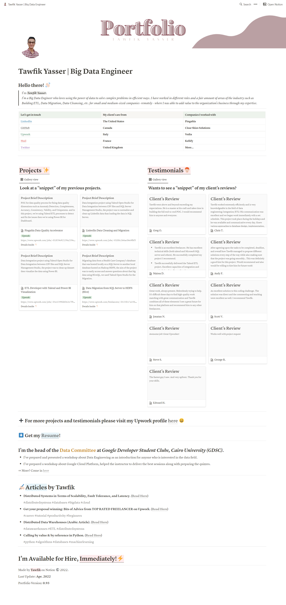

<!--<p align="center">
  
      
   
      
2-2-2022

  <!--
  ```python
        Tawfikd Yasser = { 'Skills' : [SQL - ETL - DWH - Hadoop - Talend - Python - Java - Shell - Git - RESTful API] }
 [LinkedIn](https://www.linkedin.com/in/tawfikyasser) +| [Mail](mailto:tawfekyassertawfek@gmail.com)
  ```   </p>d-->


   


<p><a href="https://bit.ly/bdetwk1" target="_blank"><strong>My Portfolio</strong></a></p>

**[Upwork](https://www.upwork.com/freelancers/~0153b17a33b0226c96) - [LinkedIn](https://www.linkedin.com/in/tawfikyasser/) - [Mail](mailto:tawfekyassertawfek@gmail.com)**

[Ranked 14th among the most active GitHub users in 2021 in Egypt 🆙⬆️⬆️](https://commits.top/egypt.html)
